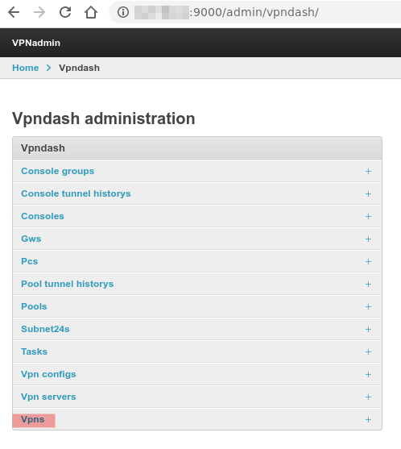
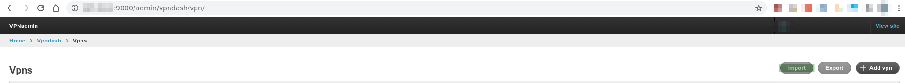

Add proxies
----

For create tunnels you need socks5 and http proxies.
Create csv file with this format
```csv
ip,socks_proxy_port,http_proxy_port,user,password,tunnel_type
1.1.1.1,1080,8080,yourproxyuser,yourpassword,socks
```

1. Go to admin panel and go to vpn submenu



2.Click import


3. Select file format and load your file with proxies