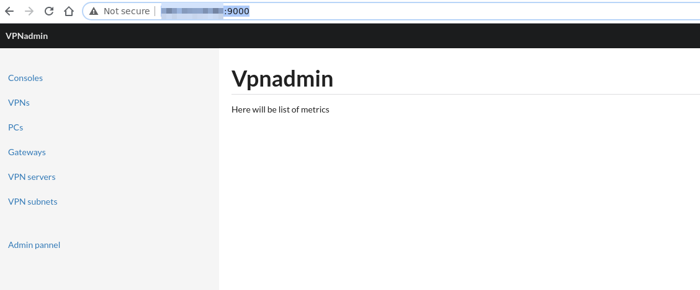
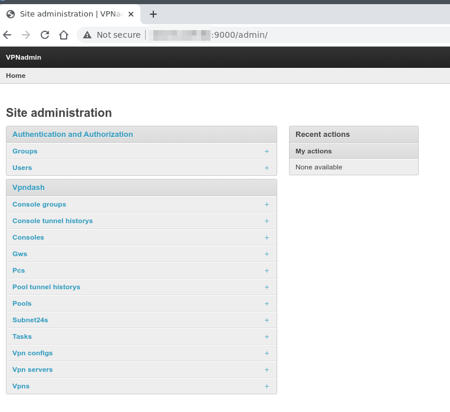

Admin deployment
-----

Requirements
---
- RAM: min 4Gb
- HDD: min 80Gb
- OS: Ubuntu 18.04 LTS


----
**All actions must be carried out on a fresh OS**
[Basics](./admin_deployment.md)

1.Go to directory where you download vpntools.tar.gz archive 
```shell
sudo mkdir /tmp/vpnadmin && sudo tar -xf vpntools.tar.gz -C /tmp/vpnadmin
```
2. Run deploy script. It will install all dependencies and create superuser. **Store dataa in end of script**. It will be need in next steps 
```shell
sudo bash /tmp/vpnadmin/devops/deploy_admin.sh -c -i
#... many output will be here

#---------------------------------------------------------------------------
#Admin listen address http://192.168.0.2:9000
#Login: vpnadmin
#Password: w5maiQGsVRzznUunILAj
#---------------------------------------------------------------------------
 ```
4. Now you can access admin panel by listen address. Please make this ip address static on your router.


5. Admin panel is secured by login auth. Access data was generated above.

