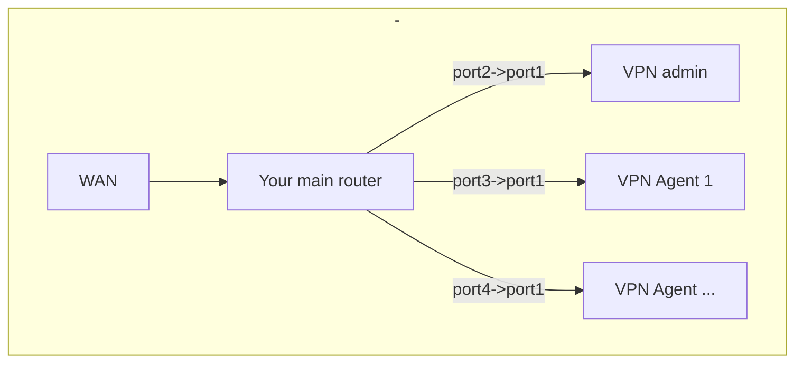
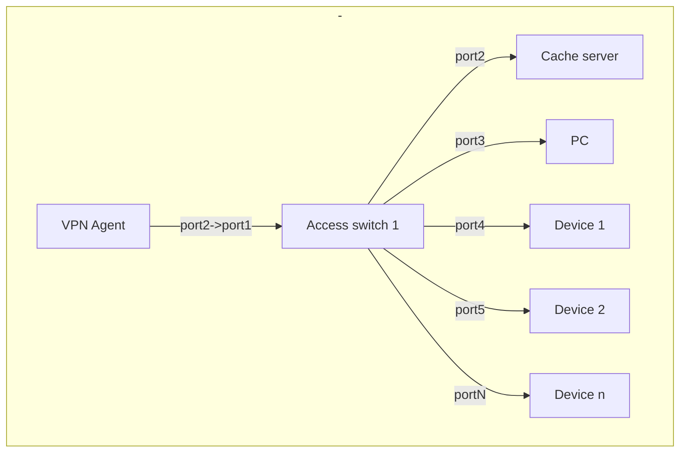
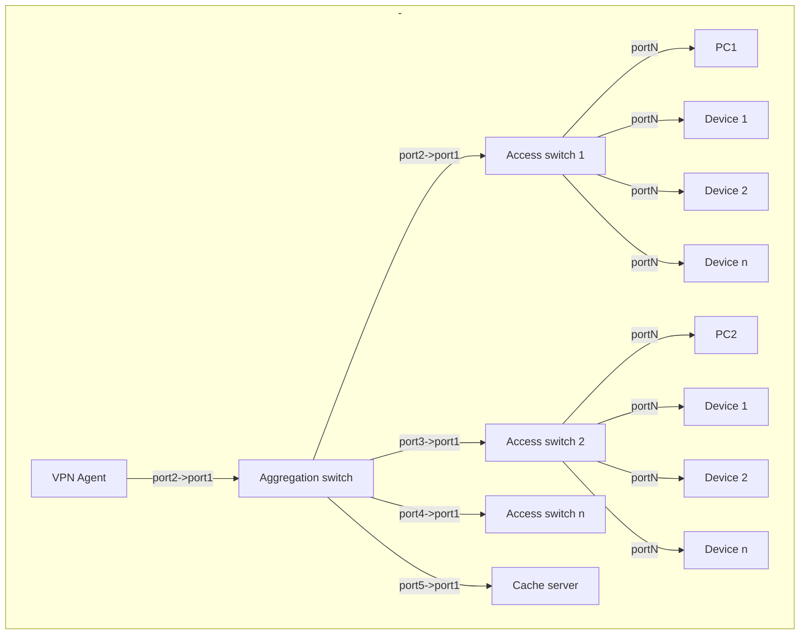

Basic architecture
---

###**Terms:**
- **VPN Admin** - **pc** with installed admin panel. This panel need for control **vpn agents**
- **VPN Agent (Gateway)** - **pc** that do all work for tunneling your devices. It acts as a router for your end devices.
Separate subnetwork created. Addresses in this range will be such as _10.1.0.10,10.1.0.240,etc_. 
- **Aggregation switch** - this switch need for aggregate **access switches** to single **vpn agent** network.
- **Access switch** - your end devices will be connected to this switch.
- **Caching server** - PC that acts as http cache server for your end devices.
- **End device** - device that connected to gateway. It can be pc,console etc.
- *portN* - ethernet port of switch/router/pc. N is a port number. For vpn agent port1 its mean first network card (connected to your primary network)
and port2 is second network card (connected to aggregate switch or access switch).

----

##### Top network architecture diagram
<!-- generated by mermaid compile action - START -->

  
Mermaid markup

<!-- generated by mermaid compile action - END -->
*Next you can use one of configuration*

## Configuration 1

*For small deployments lower than 40 end devices*

You connect  **access switch** to **vpn agent**.
Your end devices will be connected to **access switch** ports. **Cache server** is optional
<!-- generated by mermaid compile action - START -->

  
Mermaid markup

<!-- generated by mermaid compile action - END -->

## Configuration 2

*For medium or large deployments greater than 40 end devices*

You connect **aggregation switch** to **vpn agent**. Then you connect **access switches** to your **aggregate switch**.
Your end devices except **caching server** will be connected to **access switch** ports
<!-- generated by mermaid compile action - START -->

  
Mermaid markup

<!-- generated by mermaid compile action - END -->
